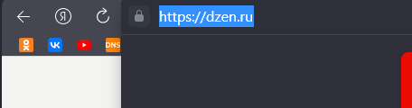

# Итак, домашнее задание:

## На основе сайта dzen.ru:

1. Определите, на каком протоколе работает сайт. 

_Ответ:_ Сайт работает на протоколе https. Сертификат действителен до 17.05.2023.

2. Внесите не менее 8 изменений на страницу с помощью инструмента разработчика и представьте скриншоты было/стало.

_Было_ 

_Стало_ 

_Изменено:_

1. Изменен фон поиска.
2. Замена  Логотипа и Надписи "Дзен" на "Яндекс Дзен".
3. Удалено Лого и "Установить Яндекс Браузер".
4. Замена Картинки в Дзен всегда под рукой для IOS и Android.
5. Увеличен шрифт в слове "Чита".
6. Изменен фон новостей.
7. Изменена температура с -17 до -150.
8. Удалена колонка справа.
